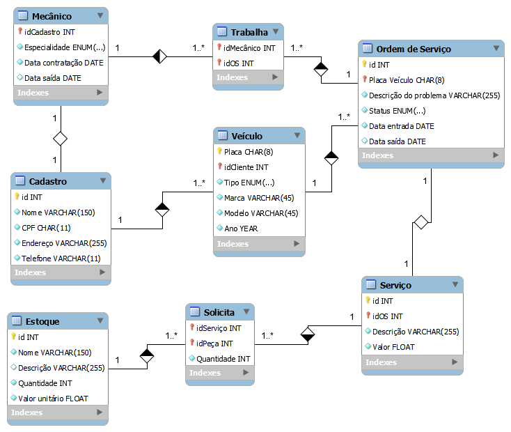

# Oficina mecânica:
 Modelagem de dados para uma Oficina Mecânica utilizando MySQL Workbench.

## Requisitos:
- Sistema de controle e gerenciamento de execução de ordens de serviço em uma oficina mecânica.
- Clientes levam veículos à oficiona mêcanica para serem consertados ou para passarem por revisões periódicas.
- Cada veículo é designado a uma equipe de mecânicos que identifica os serviços a serem executados e preenche uma OS com data de entrega.
- A parti da OS, calcula-se o valor de cada serviço, consultando-se uma tabela de referência de mão de obra.
- O valor de cada peça também irá compor a OS.
- O cliente autoriza a execução dos serviços.
- A mesma equipe avalia e executa os serviços.
- Os mecânicos possuem código, nome, endereço e especialidade.
- Cada OS possui: nº, data de emissão, um valor, status e uma data para conclusão dos trabalhos.
- Uma OS pode ser composta por vários serviços e um mesmo serviço pode estar contida em mais de uma OS.
- Uma OS pode ter vários tipos de peça e uma peça pode estar presente em mais de uma OS.

## Objetivo:
- [x] Cria o esquema conceitual para o contexto de oficina com base na narrativa fornecida

## Diagrama EER:
 